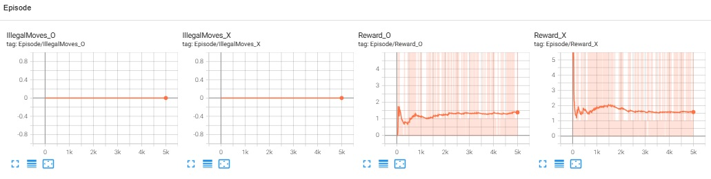
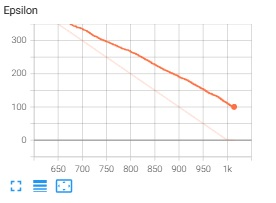
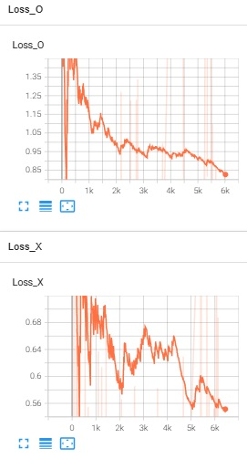
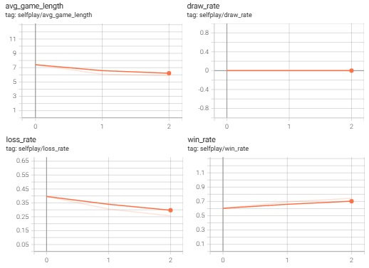
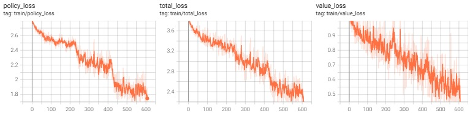

# TactiQ: 4x4 Tic-Tac-Toe RL (DQN and AlphaZero-style)

## Project Overview
This repository contains two independent reinforcement-learning implementations for the same game setting: **4x4 Tic-Tac-Toe with win length = 3** (action space = 16 cells).

- `dqn_version/`: value-based self-play using Deep Q-Learning
- `alphazero_version/`: AlphaZero-style self-play using MCTS + policy/value network

The point of the project is to compare a classic off-policy value-learning pipeline (DQN) with a search-guided policy/value pipeline (AlphaZero-like). In practice, the DQN branch is simpler to run and reason about, while the AlphaZero branch uses stronger planning (MCTS) at the cost of more compute per move and more moving parts.

### DQN vs AlphaZero (high-level)
- **DQN branch**: learns Q-values directly, uses epsilon-greedy exploration, replay memory, and a target network.
- **AlphaZero branch**: uses neural priors + value estimates inside MCTS, trains from self-play trajectories with policy/value targets.
- **Typical tradeoff**:
  - DQN: simpler and faster step-to-step.
  - AlphaZero-style: stronger decision quality from search, but more expensive per action.

---

## Repository Structure
```text
.
├── requirements.txt
├── dqn_version/
│   ├── train.py
│   ├── agent.py
│   ├── model.py
│   ├── lastmemory.py
│   ├── tictactoeenv.py
│   ├── tictactoeboard.py
│   ├── player_vs_ai.py
│   ├── evaluate.ipynb
│   ├── runs/common_run/                  # TensorBoard event logs
│   ├── trained_models/                   # trained_model_X.pth, trained_model_O.pth
│   └── training_tensorboard_results/     # static screenshot images
└── alphazero_version/
    ├── train.py
    ├── alphazero_trainer.py
    ├── mcts.py
    ├── model.py
    ├── tictactoe_game.py
    ├── tictactoeboard.py
    ├── player_vs_ai.py
    ├── evaluate.ipynb
    ├── runs/alphazero_run/               # TensorBoard event logs
    ├── trained_models/                   # model_0.pth, model_1.pth, model_2.pth
    └── training_tensorboard_results/     # static screenshot images
```

---

## How It Works (High-level)

### DQN Pipeline (`dqn_version`)
Game/environment:
- `TicTacToeEnv(size=4, win_length=3)` in `tictactoeenv.py`
- Reward logic in `play_step`:
  - illegal move: `-5.0`, not terminal
  - win: `+10.0`, terminal
  - draw: `-2.0`, terminal
  - otherwise: shaped reward from local consecutive-streak count

Agent/training mechanics:
- Two agents are trained in self-play (`Agent(..., player_mark=1/-1)`).
- Replay memory: `deque(maxlen=100_000)` with mini-batch size `1000`.
- Epsilon-greedy policy with valid-action masking:
  - `epsilon = max(0, 1000 - step)`
  - exploration check: `random.randint(0, 400) < epsilon`
- Q-network + target network (hard copy every 200 trainer steps).
- Loss: MSE on Bellman-updated targets (`QvalueTrainer`).
- Training loop (`train.py`):
  - short-memory updates every move
  - long-memory updates when episode/round ends
  - illegal-move limit per side: `100`
  - explicit extra loser-side penalty update (`-10`) via `LastMemory`

Artifacts:
- TensorBoard logs: `dqn_version/runs/common_run`
- Saved models: `dqn_version/trained_models/trained_model_X.pth`, `trained_model_O.pth`

### AlphaZero-style Pipeline (`alphazero_version`)
Game/state API:
- `TicTacToeGame(size=4, win_length=3)` in `tictactoe_game.py`
- Canonical/neutral perspective via `change_perspective`
- Encoded state shape: `(3, 4, 4)` channels = opponent, empty, own

Network:
- `PolicyValueNet` with:
  - conv stem (`num_hidden=64`)
  - `num_res_blocks=4`
  - policy head -> logits over 16 actions
  - value head -> scalar in `[-1, 1]` via `tanh`

MCTS (`mcts.py`):
- Root prior from network policy logits (softmax)
- Valid-move masking + renormalization
- Optional Dirichlet noise at root during training (`dirichlet_epsilon`, `dirichlet_alpha`)
- PUCT child selection using prior + value statistics
- Backpropagated value with perspective flip at each tree level
- Returned training policy = normalized visit counts

Self-play + optimization (`alphazero_trainer.py`):
- For each move:
  - run MCTS on neutral state
  - sample action from policy with temperature scaling (`temperature=1.25`)
  - store `(state, policy, player)`
- On terminal:
  - convert trajectory to `(encoded_state, policy_target, value_target)` from each player perspective
- Train policy/value heads jointly:
  - policy loss: soft-target cross-entropy with MCTS distribution
  - value loss: MSE to game outcome
  - total loss = policy + value

Current training config in `train.py`:
- `num_iterations=3`
- `num_selfPlay_iterations=500` (games per iteration)
- `num_epochs=4`
- `batch_size=64`
- `num_searches=60`
- `C=2.0`
- `optimizer=Adam(lr=0.001, weight_decay=0.0001)`

Artifacts:
- TensorBoard logs: `alphazero_version/runs/alphazero_run`
- Saved checkpoints: `alphazero_version/trained_models/model_<iteration>.pth`

---

## Installation
No Python version is pinned in the repo. Based on dependencies and code style, **Python 3.10+** is a practical baseline (notebooks in this repo metadata show Python 3.12.7).

```bash
# optional: create and activate a virtual environment first
python -m venv .venv
source .venv/bin/activate        # Linux/macOS
# .venv\Scripts\activate         # Windows PowerShell

pip install -r requirements.txt
```

Dependencies in `requirements.txt`:
- `numpy`, `tqdm`
- `torch`
- `tensorboard`
- `matplotlib`, `pandas`

---

## Usage / Quickstart

### 1) Train DQN
From repo root:
```bash
python dqn_version/train.py
```

### 2) Train AlphaZero-style model
From repo root:
```bash
python alphazero_version/train.py
```

### 3) Play vs AI (GUI)
```bash
# DQN GUI (loads trained_model_X.pth and trained_model_O.pth)
python dqn_version/player_vs_ai.py

# AlphaZero GUI (loads latest model_<iteration>.pth automatically)
python alphazero_version/player_vs_ai.py
```

### 4) Evaluation notebooks
Both notebooks rely on local imports and `os.getcwd()` for model paths, so open each notebook from its own folder:

```bash
cd dqn_version
jupyter notebook evaluate.ipynb
```

```bash
cd alphazero_version
jupyter notebook evaluate.ipynb
```

Notebook evaluation logic:
- **DQN notebook**: self-play X-vs-O, X-vs-random, random-vs-O, random-vs-random (`NUM_EPISODES = 1000` in notebook).
- **AlphaZero notebook**: evaluates each `model_<i>.pth` vs random and in self-play MCTS-vs-MCTS (`num_episodes=300`, `num_searches=100` in notebook cells).

### 5) TensorBoard
From repo root:
```bash
tensorboard --logdir=dqn_version/runs
tensorboard --logdir=alphazero_version/runs
```

---

## Results (TensorBoard screenshots)

### DQN (`dqn_version/training_tensorboard_results`)

1. **Illegal moves and rewards**


2. **Epsilon / exploration curves**


3. **Loss curves**


### AlphaZero-style (`alphazero_version/training_tensorboard_results`)

1. **Self-play rates and average game length**


2. **Policy/value/total loss curves**


---

## Reproducibility
- **AlphaZero branch**:
  - Fixed seeds in `alphazero_version/train.py`:
    - `torch.manual_seed(0)`
    - `np.random.seed(0)`
    - `random.seed(0)`
  - Logs written to `alphazero_version/runs/alphazero_run`
  - Checkpoints saved to `alphazero_version/trained_models/model_<iteration>.pth`

- **DQN branch**:
  - Fixed seeds in `dqn_version/train.py`:
    - `torch.manual_seed(0)`
    - `np.random.seed(0)`
    - `random.seed(0)`
  - Logs written to `dqn_version/runs/common_run`
  - Models saved to `dqn_version/trained_models/trained_model_X.pth` and `trained_model_O.pth`

- **Directory roles**:
  - `runs/`: raw TensorBoard event files from training
  - `trained_models/`: serialized PyTorch checkpoints
  - `training_tensorboard_results/`: static image exports/screenshots of training curves

---

## License
MIT License. See `LICENSE`.

---

## Acknowledgements / References
- DQN direction inspired by the Deep Q-Network line of work (Mnih et al.).
- AlphaZero-style direction inspired by self-play + MCTS + policy/value learning (Silver et al.).
